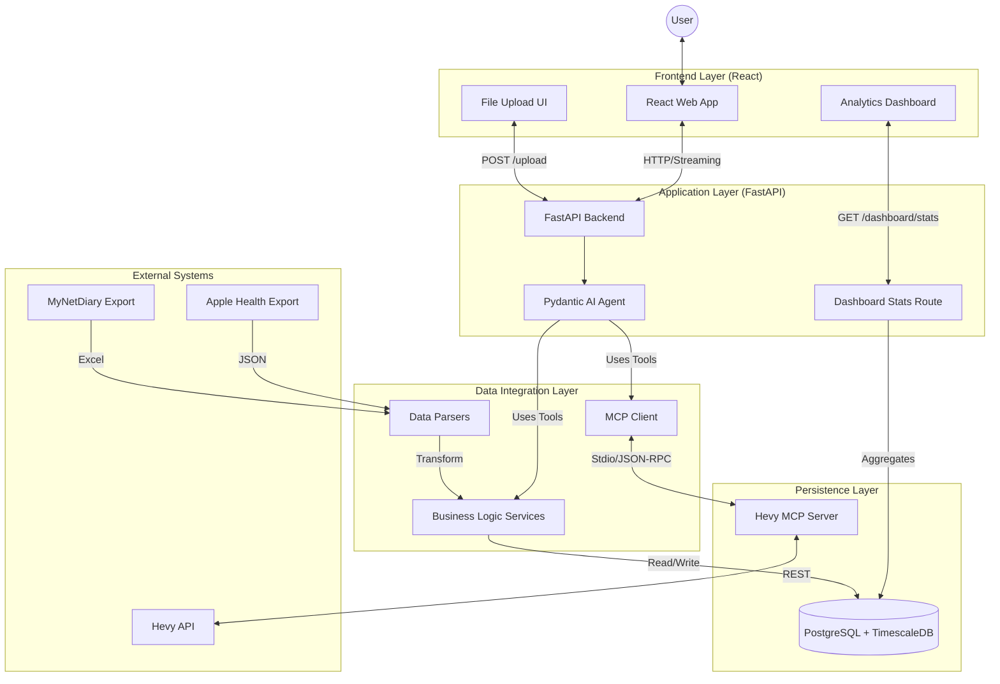

# Workout Optimizer - Technical Guide & System Architecture

**Last Updated:** December 20, 2025
**Version:** 1.1 (MVP Candidate Ready)

This document provides a deep technical dive into the Workout Optimizer codebase. It is designed for engineers and developers to understand the system's internal mechanics, architectural decisions, and data flows.

---

## 1. High-Level Architecture

The Workout Optimizer is a **Vertical AI Application** designed to aggregate scattered health data and provide personalized coaching via an autonomous agent.

### System Context Diagram



---

## 2. The "Brain": AI Agent Architecture

The core of the system is a **Single Agent with Parallel Tool Processing**, built on **Pydantic AI**.

### Tool Categorization
Tools are organized into domain-specific modules in `backend/agents/tools/`:

*   **`workout_tools.py`**: Queries history, PRs, and performs **Plateau Detection** (`detect_plateaus`).
*   **`nutrition_tools.py`**: Calculates macro averages and caloric trends.
*   **`health_tools.py`**: Retrieves sleep, steps, and weight metrics.
*   **`analysis_tools.py`**: Performs cross-domain correlation (e.g., `analyze_nutrition_vs_training`).

### Execution Flow

When a user asks a complex question like *"Why is my bench press stuck?"*, the agent:
1.  **Analyzes Intent**: Recognizes a performance issue.
2.  **Parallel Tool Call**: Simultaneously triggers `detect_plateaus("Bench Press")`, `get_nutrition_stats(days=30)`, and `get_health_metrics(days=30)`.
3.  **Synthesis**: Correlates the findings (e.g., "Weight stalled while protein intake dropped 20%").
4.  **Action**: Streams a response with specific, data-backed recommendations.

---

## 3. Data Layer: PostgreSQL + TimescaleDB

We use a hybrid relational/time-series database design to handle high-frequency health data and complex relationship data.

### Key Tables

| Table | Type | Purpose |
|-------|------|---------|
| `nutrition_daily` | Relational | Daily macro totals + full fidelity `raw_data` JSONB. |
| `workout_cache` | Relational | Synced summaries of workouts from Hevy/Apple Health. |
| `health_metrics_raw` | **Hypertable** | High-frequency time-series data (Heart Rate, Energy). |
| `chat_sessions` | Relational | Persistent storage for conversation history. |

---

## 4. Dashboard & Visualization

The app provides a real-time analytics dashboard via the `/dashboard/stats` endpoint.

### Aggregation Logic (`backend/routes/dashboard.py`)
This route bypasses the AI Agent for speed and performs direct SQL aggregations:
*   **Weekly Progress**: Normalized workout scores based on duration/intensity.
*   **Muscle Split**: Percentage distribution extracted from `workout_data` JSONB.
*   **Heatmap**: 28-day activity grid calculated from workout timestamps.

---

## 5. Data Ingestion Pipelines

### Web-Based Uploads
Users can now ingest data directly through the UI via the "Paperclip" button in the chat.
1.  **Frontend**: Triggers a file picker, wraps the file in `FormData`, and sends to `/nutrition/upload`.
2.  **Backend**: Identifies the parser, validates the schema, performs an **UPSERT** to prevent duplicates, and returns a summary message.

---

## 6. Frontend Architecture

### Component Guide
*   **`ChatInterface.tsx`**: Manages streaming LLM state and file upload triggers.
*   **`ChartsSection.tsx`**: Fetches and renders dashboard visualizations using Tailwind-based progress bars and grids.
*   **`Sidebar.tsx`**: Orchestrates the layout of stats, workout history, and charts.

---

## 7. Directory Structure Guide

```
/
├── backend/
│   ├── agents/
│   │   ├── agent.py          # Main agent definition
│   │   ├── dependencies.py    # Session factory injection
│   │   └── tools/             # AI tools (SQL/MCP wrappers)
│   ├── routes/
│   │   ├── dashboard.py       # NEW: Analytics aggregation
│   │   ├── nutrition.py       # File upload handling
│   │   └── workouts.py        # Hevy sync handling
│   ├── db/
│   │   └── models.py          # SQLAlchemy schema
│   └── main.py                # FastAPI entry & chat routes
├── web/
│   └── src/
│       ├── components/        # UI Layer
│       └── services/          # API Client (api.ts)
└── TECHNICAL_GUIDE.md         # You are here
```

---

## 8. Development Workflows

### Creating an Analysis Tool
1.  Add logic to `backend/agents/tools/analysis_tools.py`.
2.  Use `ctx.deps.session_factory()` for parallel-safe DB access.
3.  Ensure the docstring clearly explains *when* the agent should use the tool.

### Testing the "Full Loop"
1.  Upload a `MyNetDiary` Excel file via the UI.
2.  Verify the Dashboard updates instantly.
3.  Ask the Chat: *"Analyze my nutrition from that upload."*